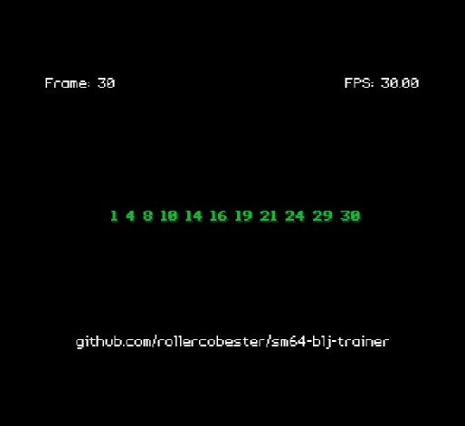

# sm64 blj trainer


**sm64 blj trainer** is a Nintendo 64 ROM for practicing consistent frame-perfect bljs in Super Mario 64. This ROM is a n64 port of xandrey's practice tool. The GUI is also heavily inspired by [wermi's controller test ROM (mimi)](https://github.com/wermipls/mimi)

## Download
Latest version of the ROM can be found [here](https://github.com/rollercobester/sm64-blj-trainer/releases).

## Basic controls
In the main menu:
* D-Pad - select option
* A - confirm selection

On the about/help screen:
* B - return to main menu

On the practice tool screen:
Importatnt - The audio may sound completely wrong or have a slight delay on emulator depending on which one you are using. I recommend muting unless playing on actual N64 hardware.
* Start - toggle audio
* A - record blj frame
* B - return to main menu

Additional informations on usage can be found in the help screen built into the ROM.

## Building
To build the ROM, you will need to have [libdragon](https://libdragon.dev/) set up. 

Clone the repository (including submodules) and navigate to the directory:
```
git clone --recurse-submodules https://github.com/CobyWalters/sm64-blj-trainer/
cd sm64-blj-trainer
```

For initial build:
```
libdragon init
libdragon make
```

After that, the ROM should be possible to compile with just `libdragon make`.

## For developers
I tried to make this ROM with simple design principles. What I was unable to do was implement a low latency audio system that didnt require a few additional programs and manual preprocessing. Here are the steps to formatting your .wav files into .raw files:
1) Install sox at https://sox.sourceforge.net/
2) Convert your .wav file to 16 bit stereo:
```
sox path/to/inputfile.wav -b16 -c2 path/to/outputfile.wav
```
3) Install Audio File Converter at https://www.nch.com.au/switch/index.html
4) Add the .wav file
5) Convert after selecting output format: .raw with the options - Format: 16 bit PCM (Big Endian), Sample rate: 16000 Hz, Channels: Stereo

## Credits
* xandrey - initial python code
* coby - porting to n64

Special thanks to xandrey, wermi, kolunio, GTM_, and GreenSuigi.

### 3rd party assets
* [Enter Command font by Font End Dev](https://fontenddev.com/fonts/enter-command/), licensed under CC BY 4.0

## License
MIT